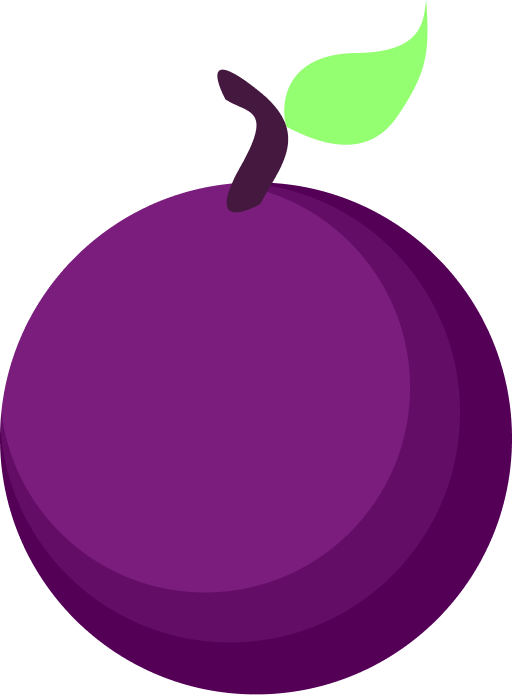

<p align="center">
  
</p>

# Plum

Plum is a small, compiled, stack-based programming language. Programs are written as postfix token streams operating on a single data stack, similar in spirit to Forth: values are pushed, and operators and procedures consume whatever they need off the top of the stack. Plum compiles this directly to native assembly rather than interpreting it.

> **Status:** Plum currently only compiles to AArch64 (ARM64) assembly on macOS as well as x86_64 on Windows. A Linux port is underway. See [Roadmap](#roadmap).

## Requirements

- Python 3
- `gcc` or `clang` on `PATH` (used to assemble and link the generated `.s` file)
- macOS on Apple Silicon (arm64) — for now

## Building a .plum file

```
python plum.py <file.plum>
```

This produces `<file>.s` (the generated AArch64 assembly) and `<file>` (the linked, runnable executable).

### CLI options

```
python plum.py <source> [--emit FILE] [-o FILE] [--flags ...]
```

| Flag | Description |
|---|---|
| `--emit FILE` | Base path for the generated assembly (`.s` is appended). Defaults to the source file's name. |
| `-o FILE` | Path for the compiled executable. Defaults to the source file's name. |
| `--flags ...` | Must be last on the command line. Everything after it is forwarded as-is to the compiler/linker, e.g. extra libraries or frameworks. |

For example, building the raylib demo below:

```
python plum.py tests/game.plum --flags -I/opt/homebrew/include -L/opt/homebrew/lib -lraylib -framework OpenGL -framework Cocoa -framework IOKit -framework CoreVideo
```

## A taste of Plum

```
import "std/io"

proc main ( ) :
    "Hello from Plum!" "%s" $1 @println
    0 return
end
```

A Rule 110 cellular automaton, using `alloc`, indexed static buffers, and nested `while` loops (`tests/rule110.plum`):


## Built with Plum: a raylib game

<!-- TODO: drop the game screenshot in here, e.g.:

-->

`tests/game.plum` is a small paddle-and-ball game built against [raylib](https://www.raylib.com/) through Plum's `extern proc` FFI (see `import/raylib.plum`). It's a good example of a real, interactive Plum program: static game state, a main loop, keyboard input, and drawing calls, all driving a native window.

https://github.com/user-attachments/assets/5c2a9aba-971a-4129-a8c6-fc31fd15399e

## Language overview

### Stack & evaluation
Everything happens on one implicit data stack. Literals push; words pop. Common stack shufflers: `dup`, `drop`, `swap`, `over`, `rot`, `pick`.

### Types
`byte`, `dword`, `qword`, `ptr` for scalars, plus aggregate forms like `[byte4]` for packing several small values into one FFI argument (used for RGBA colors when calling raylib).

### Procedures
```
proc name ( param types ) return type :
    ...
end
```
Parameters are typed by their stack slot, not named. `extern proc` declares a foreign function to link against (libc, raylib, ...) without a body.

### Static storage
```
static name type count
```
Declares named, fixed-size storage. `.name` loads a static's address, `.` dereferences, `[]` indexes/dereferences a pointer, `[]=` stores through one.

### Control flow
```
if <cond> == do ... else ... end
0 while dup 64 < do ... end drop
```

### Macros
```
macro NAME value
```
A simple textual substitution, expanded wherever `@NAME` appears, resolved before compilation. `[hijack]` blocks are the escape hatch: they splice raw target assembly directly into the output, at the macro level (e.g. reading a libc global in `std/io.plum`) or at the procedure level, replacing Plum-generated prologue/epilogue entirely (see `tests/hijack.plum`).

### Memory
`alloc` / `free` for heap allocation.

### Imports
```
import "std/io"
```
Resolved relative to the compiler's own directory and inlined during preprocessing, before macro expansion — so imported files can define macros the importer uses.

### Standard library
- `std/io` — libc bindings (`printf`, `fopen`/`fread`/... family) plus `print`/`println` convenience macros
- `std/mem` — `smart_alloc` / `smart_free`, a simple allocation-tracking allocator built on `alloc`/`free`
- `std/lib` — misc shared constants

## Project layout

```
plum.py           CLI entry point: arg parsing, preprocessing, dispatch to a target codegen
plum_mac_arm.py   AArch64/macOS code generator
std/              Standard library
import/           Third-party FFI bindings (currently raylib)
tests/            Example & regression programs
test.py           Compiles and runs every tests/*.plum, reports pass/fail
```

## Running the test suite

```
python test.py
```

## Roadmap

- [x] AArch64 codegen on macOS
- [x] x86_64 codegen for Windows
- [ ] x86_64 codegen for Linux

## License

MIT — see [LICENSE](LICENSE).
